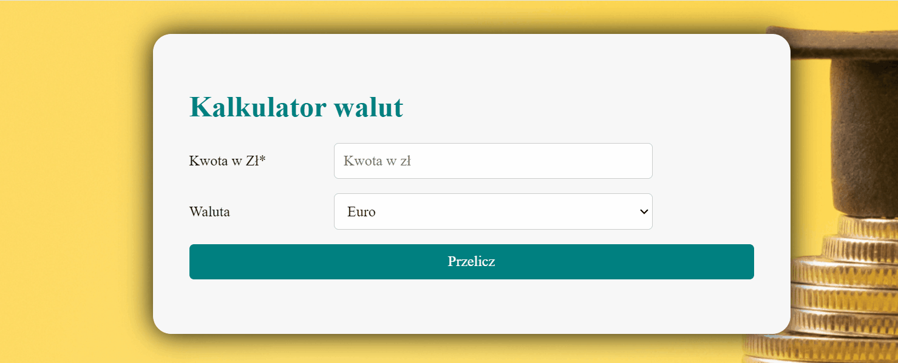

# Currency-Converter

## This simple calculator converts Polish zloty (PLN) to foreign currencies (USD, EURO, GBP).

You can also test it yourself, it is very easy to use:
- in the first column (Kwota w Zł) you enter the value of the PLN amount you want to convert,
- in the second column (Waluta) you choose the foreign currency you are interested in (EURO, USD, GBP),
- click on the Recalculate button (Przelicz).

The converted amount in foreign currency will appear below, as on the gif.

Link below:

https://tomaszbrylski.github.io/currency-converter/

### Languages / Technologies
- HTML
- CSS
- Flex
- JavaScript
- BEM
- ScreenToGit
